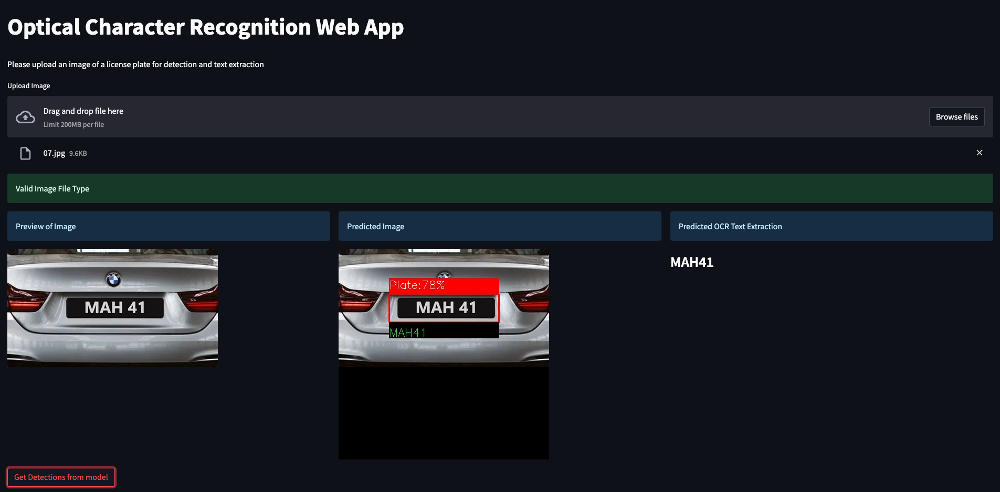

## Welcome to my portfolio website!

### About Me:

My name is Jacob Johnson, and I'm a highly skilled Tableau Certified Data Analyst with a passion for solving complex problems using machine learning and deep learning techniques. I have extensive experience working with SQL, AWS, Tableau, Python, PyTorch, Scikit Learn, Keras, TensorFlow, Computer Vision, and NLP.

I hold a Bachelor of Science in Mathematics with a minor in Physics from The Pennsylvania State University, and a FinTech Professional Certificate from The University of Pennsylvania.

## Portfolio

---

### Machine Learning Guide
[Machine Learning Guide](https://jacobj215.github.io/Machine-Learning-Guide/)

***Please note that this guide is still a work in progress**

The idea behind this Intro to Machine Learning Guide was to initially create a list of resources to provide to my students. This eventually morphed into a comprehensive guide that will eventually cover everything from Linear Regression to Neural Networks

### Computer Vision Projects

[Optical Character Recognition Web App](https://jacobj215.github.io/Optical-Character-Recognition-WebApp/)

This project is a web application that uses YOLOv5 and InceptionResNetV2 models for license plate detection and Optical Character Recognition (OCR) text extraction. The web applications were built using streamlit and flask

[Face Mask Detection YOLOv7](https://github.com/JacobJ215/YOLOv7_Face_Mask_Detection)

Object Detection project created to detect face mask using YOLOv7 trained on a custom dataset. All 853 images were manually annotated using labelimg, two labels were used to classify the images, "Mask" and "No Mask". Training was performed over 300 epochs and a batch size of 8 using google colab in the YOLOv7 Training.ipynb file.

[View on Google Colab](https://colab.research.google.com/drive/1sHsHq1hfRaJp-EOkqOmEMKkBhORoblu5?usp=sharing)

---

### Deep Learning Projects

Comning soon!!!

---

### Machine Learning Projects

[Pokemon Stats Analysis](https://jacobj215.github.io/Pokemon-Stats-Analysis/)

[Link to Tableau Dashboard](https://public.tableau.com/views/pokemon_16807219032990/PokemonAnalysisDashboard?:language=en-US&publish=yes&:display_count=n&:origin=viz_share_link)

This is a data analysis and machine learning project that focuses on analyzing the stats of Pokemon from the popular Pokemon game series. The project utilizes Python and various data analysis libraries to explore and visualize the data, as well as perform statistical analysis on the Pokemon stats and utilize machine learning to  predict a pokemon's legendary status.

[View on Google Colab](https://colab.research.google.com/drive/1aE61ea_nG6HwBX7OQRavFV3GiZJdNOHi?usp=sharing)

[Telecom Churn Analysis and Prediction](https://jacobj215.github.io/Churn-Analysis-and-Prediction/)

[Link to Tableau Dashboard](https://public.tableau.com/views/ChurnDashboard_16836452983320/ChurnDashboard?:language=en-US&publish=yes&:display_count=n&:origin=viz_share_link)

This repository contains the code for analyzing telecom churn rate. The aim of this project is to predict whether a customer will churn or not based on various features.
In this project, we analyzed the telecom churn rate using various machine learning algorithms. The best performing model was XGBoost with an accuracy of 81.92%. We also performed SHAP analysis to interpret the XGBoost model and found that MonthlyCharges, Tenure, and InternetService_Fiber optic were the most important features in predicting churn.

[View on Google Colab](https://colab.research.google.com/drive/1KHAz6vBfsyrZ6AQDs5YovIRazEb27eK6?usp=sharing)

More Comning soon!!!

---

Page template forked from <a href="https://github.com/evanca/quick-portfolio">evanca</a>

<!-- Remove above link if you don't want to attibute -->
