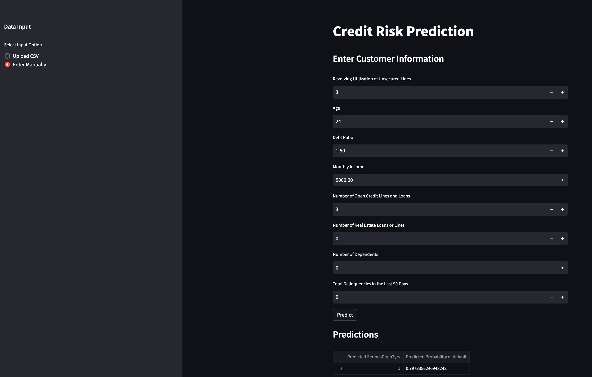

## Welcome to my portfolio website!

### About Me:

My name is Jacob Johnson, and I'm a highly skilled Tableau Certified Data Analyst with a passion for solving complex problems using machine learning and deep learning techniques. I have extensive experience working with SQL, AWS, Tableau, Python, PyTorch, Scikit Learn, Keras, TensorFlow, Computer Vision, and NLP.

I hold a Bachelor of Science in Mathematics with a minor in Physics from The Pennsylvania State University, and a FinTech Professional Certificate from The University of Pennsylvania.

## Portfolio

---

### Computer Vision Projects

[Automatic Number Plate Recognition using YOLO-NAS and EasyOCR (Images & Videos)](https://jacobj215.github.io/YOLO-NAS-OCR-WebApp/)

This project uses YOLO-NAS and EasyOCR to detect license plates and perform Optical Character Recognition (OCR) on them. The project includes both image and video processing capabilities and has been deployed as a Streamlit web application. This is an update to a previous project, [Optical-Character-Recognition-WebApp](https://github.com/JacobJ215/Optical-Character-Recognition-WebApp)

[Face Mask Detection YOLOv7](https://github.com/JacobJ215/YOLOv7_Face_Mask_Detection)

Object Detection project created to detect face masks using YOLOv7 trained on a custom dataset. All 853 images were manually annotated using labelimg, two labels were used to classify the images, "Mask" and "No Mask". The training was performed over 300 epochs and a batch size of 8 using google colab in the YOLOv7 Training.ipynb file.

[View on Google Colab](https://colab.research.google.com/drive/1sHsHq1hfRaJp-EOkqOmEMKkBhORoblu5?usp=sharing)

---

### Deep Learning Projects

Coming soon!!!

---

### Machine Learning Projects

[Credit Card Default Web App](https://jacobj215.github.io/Credit-Card-Default/)

[Link to Streamlit Web App](https://jacobj215-credit-card-default-app-3ruasg.streamlit.app/)

This project was created to predict credit card defaults based on customer profiles, achieving a high ROC AUC score of 0.7882 The model analyzes borrower information, such as age, income, and financial indicators, to identify customers at risk of defaulting. This project also contains a streamlit web app capable of making predictions given a customer profile. 

[View on Google Colab](https://colab.research.google.com/drive/13cyq6AEXIcH2Of9jQPTi8oqVFZJ4nhtY?usp=sharing)

[Telecom Churn Analysis and Prediction](https://jacobj215.github.io/Churn-Analysis-and-Prediction/)

[Link to Tableau Dashboard](https://public.tableau.com/views/ChurnDashboard_16836452983320/ChurnDashboard?:language=en-US&publish=yes&:display_count=n&:origin=viz_share_link)

This repository contains the code for analyzing telecom churn rate. The aim of this project is to predict whether a customer will churn or not based on various features.
In this project, we analyzed the telecom churn rate using various machine learning algorithms. The best-performing model was XGBoost with an accuracy of 81.92%. We also performed SHAP analysis to interpret the XGBoost model and found that MonthlyCharges, Tenure, and InternetService_Fiber optic were the most important features in predicting churn.

[View on Google Colab](https://colab.research.google.com/drive/1KHAz6vBfsyrZ6AQDs5YovIRazEb27eK6?usp=sharing)

More Coming soon!!!

---

Page template forked from <a href="https://github.com/evanca/quick-portfolio">evanca</a>

<!-- Remove above link if you don't want to attibute -->
